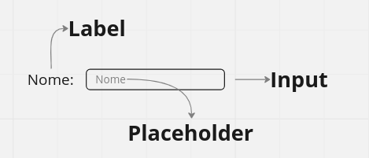

<h1>&lt;Input&gt;</h1>
    

<h2>O que significa input?</h2>

&emsp;Input é uma palavra em <i>inglês</i> que significa <strong>entrada</strong>.

<h2>Quando devo usar a tag input?</h2>

&emsp;A tag input - <code>&lt;input&gt;</code> - é usada quando precisamos que <strong>o usuário entre com alguma informação</strong>: nome, e-mail, data, fotos e etc... Normalmente usadas dentro da tag &lt;form&gt;

<h2>O que devo ficar atento?</h2>

&emsp;Caso o input não seja de texto, <strong>devo usar o atributo type</strong>.

<h2>Anatomia de uma entrada de usuário</h2>

<form action="" method="post">

<h2>Input de textos</h2>

<code>&lt;input type="text" placeholder="Nome"&gt;</code> 

<input type="text" id="text" placeholder="Nome">

<code>&lt;input type="password" placeholder="Senha"&gt;</code> 

<input type="password" id="password" placeholder="Senha">

<code>&lt;input type="email" placeholder="E-mail"&gt;</code> 

<input type="email" id="email" placeholder="E-mail">

<code>&lt;input type="search" placeholder="Pesquisar"&gt;</code> 

<input type="search" id="search" placeholder="Pesquisar">

    
<h2>Input de números</h2>

<code>&lt;input type="range" min="0" max="100" step="10"&gt;</code> 

<input type="range" min="0" max="100" step="10">

<code>&lt;input type="number" placeholder="Idade"&gt;</code> 

<input type="number" id="number" placeholder="Idade">

<code>&lt;input type="tel" placeholder="Fone"&gt;</code> 

<input type="tel" id="tel" placeholder="Fone">

<h2>Input de data</h2>

<code>&lt;input type="datetime-local"&gt;</code> 

<input type="datetime-local" id="datetime-local">

<code>&lt;input type="date"&gt;</code> 

<input type="date" id="date">

<code>&lt;input type="month"&gt;</code> 

<input type="month" id="month">

<code>&lt;input type="time"&gt;</code> 

<input type="time" id="time">

<code>&lt;input type="week"&gt;</code> 

<input type="week" id="week">

<h2>Input de cor</h2>

<code>&lt;input type="color"&gt;</code> 

<input type="color" id="color">

<h2>Input booleanos (sim ou não)</h2>

<code>
&lt;input type="checkbox" name="musica" value="funk"&gt; Funk 
&lt;input type="checkbox" name="musica" value="pagode"&gt; Pagode 
</code> 

<input type="checkbox" id="checkbox" name="musica" value="funk"> <label>Funk</label>
<input type="checkbox" id="checkbox" name="musica" value="pagode"> <label>Pagode</label>

<code>
&lt;input type="radio" name="sexo" value="feminino"&gt; 
&lt;input type="radio" name="sexo" value="masculino"&gt; 
</code>

<input type="radio" id="radio" name="sexo" value="feminino"> <label>Feminino</label>
<input type="radio" id="radio" name="sexo" value="masculino"> <label>Masculino</label>

   

<h2>Input de arquivos</h2>

<code>&lt;input type="file" accept=".jpg,.jpeg,.gif"&gt;</code> 

<input type="file" id="file" accept=".jpg,.jpeg,.gif">

<h2>Input de botões</h2>

<code>&lt;input type="reset"&gt;</code> 

<input type="reset" id="reset">

<code>&lt;input type="button"&gt;</code> 

<input type="button" id="button">

<code>&lt;input type="submit"&gt;</code> 

<input type="submit" id="submit">

</form>

<h2>Aprofundando o assunto</h2>

&emsp;Você reparou que devemos informar o <i>type</i> ao computador? Isso pode soar estranho e desnessário ao primeiro momento, mas isso é fruto de uma super habilidade que nós possuimos e o computador não: reconhecer o sentido das informações pelo contexto.  &emsp;Cada informação é lida de um jeito. Nós, seres humanos, lemos informações de tipos diferentes automaticamente. Por exemplo, se eu te disser <strong>"Eu sou de 96"</strong>, você é plenamente capaz de <i>ler</i> e entender que "Eu sou de" é um texto e "96" se refere à abreviação do ano de 1996. O mesmo não acontece com um computador, por isso devemos informar o tipo de informação para que ele saiba ler corretamente.

</body>
</html>