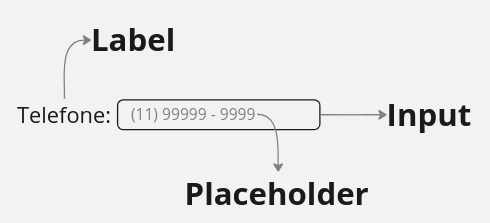

<h1>&lt;Input&gt;</h1>

<h2>O que significa input?</h2>

&emsp;Input é uma palavra do <i>inglês</i> que significa <strong>entrada</strong>.

<h2>Quando devo usar a tag input?</h2>

&emsp;A tag input - <code>&lt;input&gt;</code> - é usada quando precisamos que <strong>o usuário entre com alguma informação</strong>: nome, e-mail, data, fotos e etc... Normalmente usadas dentro da tag &lt;form&gt;

<h2>O que devo ficar atento?</h2>

&emsp;Caso o input não seja de texto, <strong>devo usar o atributo type</strong>.

<h2>Anatomia de uma entrada de usuário</h2>

<h2>Input de texto</h2>

<code>&lt;input type="text" placeholder="Nome"&gt;</code>

<code>&lt;input type="password" placeholder="Senha"&gt;</code>

<code>&lt;input type="email" placeholder="E-mail"&gt;</code>

<code>&lt;input type="search" placeholder="Pesquisar"&gt;</code>

<h2>Input de número</h2>

<code>&lt;input type="range" min="0" max="100" step="10"&gt;</code>

<code>&lt;input type="number" placeholder="Idade"&gt;</code>

<code>&lt;input type="tel" placeholder="Fone"&gt;</code>

<h2>Input de data</h2>

<code>&lt;input type="datetime-local"&gt;</code>

<code>&lt;input type="date"&gt;</code>

<code>&lt;input type="month"&gt;</code>

<code>&lt;input type="time"&gt;</code>

<code>&lt;input type="week"&gt;</code>

<h2>Input de cor</h2>

<code>&lt;input type="color"&gt;</code>

<h2>Input booleano (sim ou não)</h2>

<code>
    &lt;input type="checkbox" name="musica" value="funk"&gt; Funk</code>
<code>
    &lt;input type="checkbox" name="musica" value="pagode"&gt; Pagode
</code>

<code>
    &lt;input type="radio" name="sexo" value="feminino"&gt;
</code>
<code>
    &lt;input type="radio" name="sexo" value="masculino"&gt;
</code>

<h2>Input de arquivo</h2>

<code>&lt;input type="file" accept=".jpg,.jpeg,.gif"&gt;</code>

<h2>Input de botão</h2>

<code>&lt;input type="reset"&gt;</code>

<code>&lt;input type="button"&gt;</code>

<code>&lt;input type="submit"&gt;</code>

<h2>Input de opções</h2>
<code>
&lt;input type="text" placeholder="Mc de sua preferência" list="mcs"&gt; 
&lt;datalist id="mcs"&gt; 
&emsp;&emsp;&lt;option value="Mc Hariel"&gt; 
&emsp;&emsp;&lt;option value="Mc Paiva"&gt; 
&emsp;&emsp;&lt;option value="Mc Ryan SP"&gt; 
&lt;/datalist&gt;
</code>

<h2>Aprofundando o assunto</h2>

&emsp;Você reparou que devemos informar o <i>type</i> ao computador? Isso soa estranho e desnessário, mas é por causa de uma habilidade que temos e o computador não: reconhecer o sentido das informações pelo contexto. &emsp;Para que cada informação faça sentido, precisamos ler e interpretar conforme o seu tipo. E, nós, seres humanos, fazemos isso o tempo todo sem dificuldades. Por exemplo, se eu te disser <strong>"O Brasil foi campeão em 94"</strong>, você é plenamente capaz de <i>ler</i> e entender que "O Brasil foi campeão em" trata-se de um texto e "94" se refere ao ano de 1994. O mesmo não acontece com um computador, por isso devemos informar o tipo para que ele consiga ler corretamente.

<h2>Atividade de fixação</h2>

&emsp;Responder exercícios após uma aula ajuda a fixar as informação na memória. Então bora fazer um <a href="https://docs.google.com/forms/d/e/1FAIpQLSdXH27C3_1mQaJQq_1o8fKJoEcXv83iFaXWhenAEsn27QzvLw/viewform?usp=sf_link">teste</a> rápido?

<h2>Projeto</h2>

&emsp;Bora fazer um projeto para ver se você entendeu? O objetivo é replicar este <a href="fixacao.html">projeto</a>.

